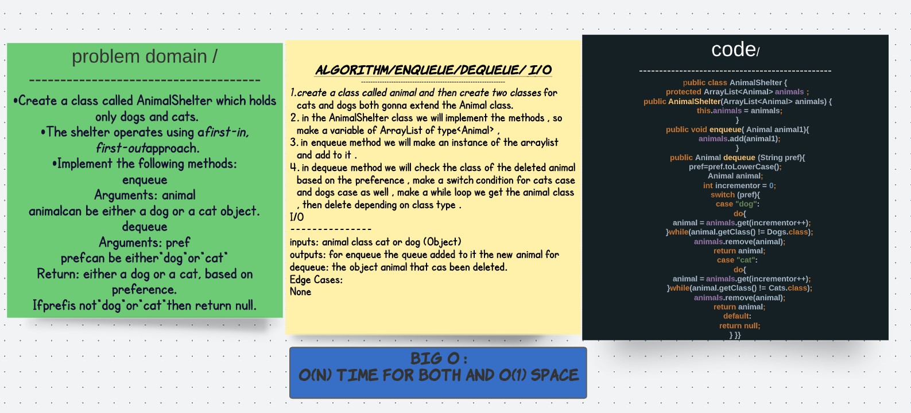

# First-in, First out Animal Shelter
## challenge 
Create a class called AnimalShelter which holds only dogs and cats.
The shelter operates using a first-in, first-out approach.
Implement the following methods:
enqueue
Arguments: animal
animal can be either a dog or a cat object.
dequeue
Arguments: pref
pref can be either "dog" or "cat"
Return: either a dog or a cat, based on preference.
If pref is not "dog" or "cat" then return null.

## solution 

## Big O :
Enqueue(String x)
Time Complexity: O(1) or O(n) if preferred animal is at the end or gone.
Dequeue()
Time Complexity: O(1) or O(n) if preferred animal is at the end or gone.

## Tests 
class AnimalShelterTest {

  @Test

  public void testAnimalShelterConstructor() {
      
    AnimalShelter animalShelter = new AnimalShelter();
    assertEquals(new ArrayList<>(), animalShelter.animals);
  }

  @Test

  public void testAnimalShelterEnqueue() {

    AnimalShelter animalShelter = new AnimalShelter();
    Dogs dog1 = new Dogs("Scooby");
    animalShelter.enqueue(dog1);
    Cats cat2 = new Cats("Garfield");
    animalShelter.enqueue(cat2);
    Cats cat3 = new Cats("HelloKitty");
    animalShelter.enqueue(cat3);
    Dogs dog4 = new Dogs("Scrappy");
    animalShelter.enqueue(dog4);

    assertEquals(4, animalShelter.animals.size());
    assertTrue(animalShelter.animals.contains(cat2));
    assertEquals(dog4, animalShelter.animals.get(animalShelter.animals.size() - 1));
  }

  @Test

  public void testAnimalShelterDequeue() {

    AnimalShelter animalShelter = new AnimalShelter();
    Dogs dog1 = new Dogs("Scooby");
    animalShelter.enqueue(dog1);
    Cats cat2 = new Cats("Garfield");
    animalShelter.enqueue(cat2);
    Cats cat3 = new Cats("HelloKitty");
    animalShelter.enqueue(cat3);
    Dogs dog4 = new Dogs("Scrappy");
    animalShelter.enqueue(dog4);

    assertEquals(dog1.getName(), animalShelter.dequeue("dog").getName());
    assertEquals(dog4.getName(), animalShelter.dequeue("dog").getName());

  }

  @Test

  public void testAnimalShelterDequeueNull() {

    AnimalShelter animalShelter = new AnimalShelter();
    Dogs dog1 = new Dogs("Scooby");
    animalShelter.enqueue(dog1);
    Cats cat2 = new Cats("Garfield");
    animalShelter.enqueue(cat2);
    Cats cat3 = new Cats("HelloKitty");
    animalShelter.enqueue(cat3);
    Dogs dog4 = new Dogs("Scrappy");
    animalShelter.enqueue(dog4);

    assertNull(animalShelter.dequeue("bird"));
  }