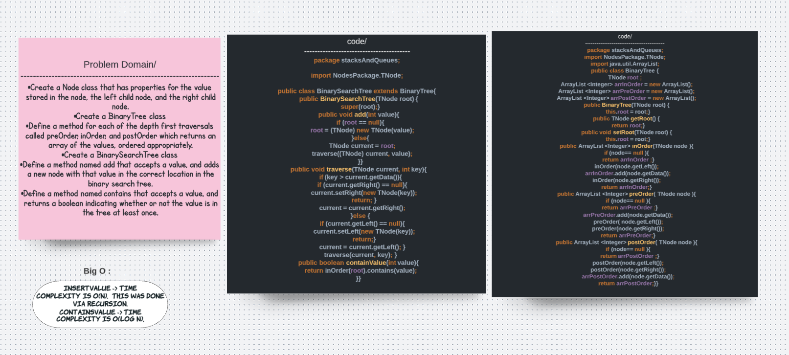

# Binary Trees and Binary Search Trees
## Challenge
Create a Node class that has properties for the value stored in the node, the left child node, and the right child node.

Create a BinaryTree class

Define a method for each of the depth first traversals called preOrder, inOrder, and postOrder which returns an array of the values, ordered appropriately.

Create a BinarySearchTree class

Define a method named add that accepts a value, and adds a new node with that value in the correct location in the binary search tree.

Define a method named contains that accepts a value, and returns a boolean indicating whether or not the value is in the tree at least once.
## Solution 

## Approach & Efficiency
Binary Tree

Time Complexity of the Depth First traversals are all O(W), where W is the width. 
Traversals were done via recursion using private helper functions that takes in the arraylist to add values and eventually return, and a BinaryTreeNode.
Binary Search Tree

insertValue -> Time Complexity is O(n),  This was done via recursion.
containsValue -> Time Complexity is O(log n).

# API
Binary Tree

default and custom constructors
getRoot(), setRoot(BinaryTreeNode node)
ArrayList preOrder()
ArrayList inOrder()
ArrayList postOrder()
Binary Search Tree

# default and custom constructors
getRoot(), setRoot(BinaryTreeNode node)
void insertValue(int val)
boolean containsValue(int val)

## Tests 

class TreeBinaryTest {

  @Test

  public void testBinaryTreeInOrder() {

    TNode binaryTreeNode = new TNode(4);
    binaryTreeNode.setLeft(new TNode(2));
    binaryTreeNode.setRight(new TNode(6));

    BinaryTree binaryTree = new BinaryTree(binaryTreeNode);

    binaryTree.getRoot().getLeft().setLeft(new TNode(1));
    binaryTree.getRoot().getLeft().setRight(new TNode(3));
    binaryTree.getRoot().getRight().setLeft(new TNode(5));
    binaryTree.getRoot().getRight().setRight(new TNode(7));
    ArrayList<Integer> expected = new ArrayList<>();
    expected.add(1);
    expected.add(2);
    expected.add(3);
    expected.add(4);
    expected.add(5);
    expected.add(6);
    expected.add(7);
// expected 1,2,3,4,5,6,7
    assertEquals(expected, binaryTree.inOrder(binaryTreeNode));
  }

  @Test
  public void preOrderTest() {

    TNode binaryTreeNode = new TNode(4);
    binaryTreeNode.setLeft(new TNode(2));
    binaryTreeNode.setRight(new TNode(6));

    BinaryTree binaryTree = new BinaryTree(binaryTreeNode);

    binaryTree.getRoot().getLeft().setLeft(new TNode(1));
    binaryTree.getRoot().getLeft().setRight(new TNode(3));
    binaryTree.getRoot().getRight().setLeft(new TNode(5));
    binaryTree.getRoot().getRight().setRight(new TNode(7));
    ArrayList<Integer> expected = new ArrayList<>();
    expected.add(4);
    expected.add(2);
    expected.add(1);
    expected.add(3);
    expected.add(6);
    expected.add(5);
    expected.add(7);
    assertEquals(expected, binaryTree.preOrder(binaryTreeNode));

  }

  @Test
  public void postOrderTest() {

    TNode binaryTreeNode = new TNode(4);
    binaryTreeNode.setLeft(new TNode(2));
    binaryTreeNode.setRight(new TNode(6));

    BinaryTree binaryTree = new BinaryTree(binaryTreeNode);

    binaryTree.getRoot().getLeft().setLeft(new TNode(1));
    binaryTree.getRoot().getLeft().setRight(new TNode(3));
    binaryTree.getRoot().getRight().setLeft(new TNode(5));
    binaryTree.getRoot().getRight().setRight(new TNode(7));

    ArrayList<Integer> expected = new ArrayList<>();
    expected.add(1);
    expected.add(3);
    expected.add(2);
    expected.add(5);
    expected.add(7);
    expected.add(6);
    expected.add(4);
    assertEquals(expected, binaryTree.postOrder(binaryTreeNode));

  }

  public void searchTreeTest() {
      
    TNode node = new TNode(2);
    BinarySearchTree binarySearchTree = new BinarySearchTree(node);
    binarySearchTree.add(3);
    binarySearchTree.add(5);
    binarySearchTree.add(7);
    binarySearchTree.add(11);

  }

}
