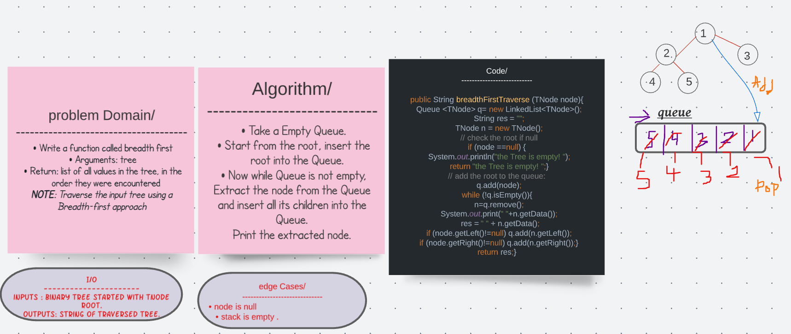

# Breadth-First Traversal 
## Challenge 
Write a function called breadth first
Arguments: tree
Return: list of all values in the tree, in the order they were encountered
NOTE: Traverse the input tree using a Breadth-first approach.

## Solution 

## Big(O) 
Big (O) time : O(n) , n is the number of nodes 
Big (O) space : O(w) , w is the width of the tree 

## Tests 
@Test
  void breadthTraversalTest(){
      
    BinaryTree tree = new BinaryTree();
    TNode node = new TNode(1);
    node.setRight(new TNode(4));
    node.setLeft(new TNode(9));
    node.getLeft().setRight(new TNode(11));
    node.getLeft().setLeft(new TNode(14));
    node.getRight().setRight(new TNode(1));
    node.getRight().setLeft(new TNode(50));

    assertEquals( " 1 9 4 14 11 50 1",tree.breadthFirstTraverse(node));
  }
