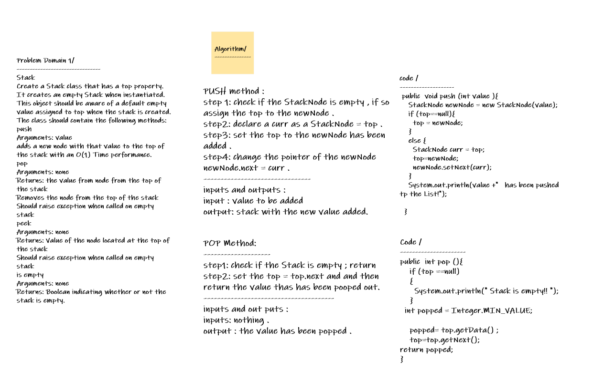
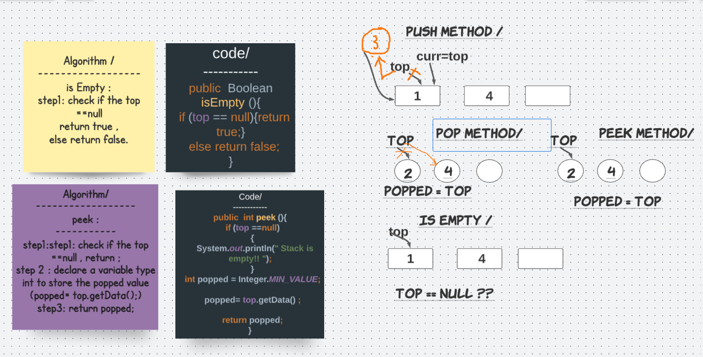
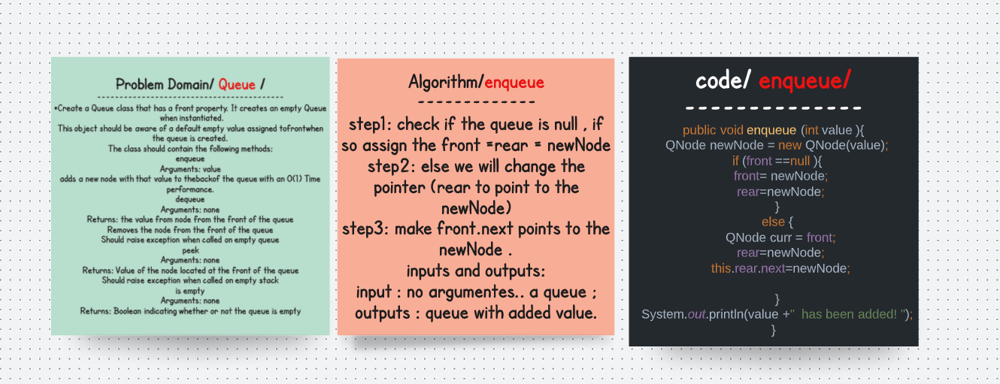
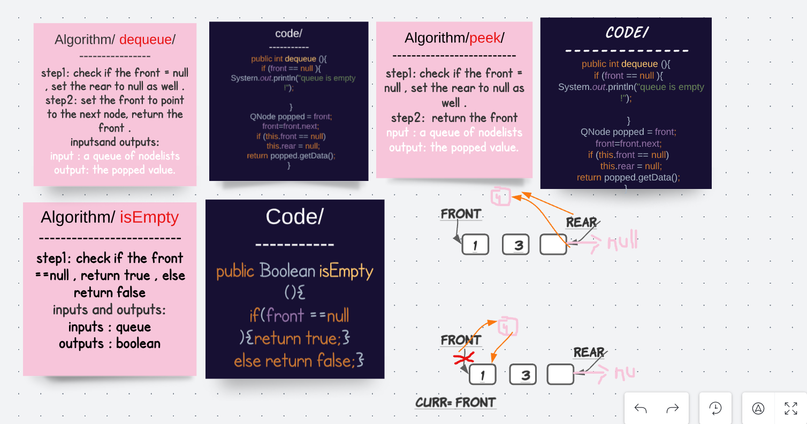

# Stack and a Queue Implementation
# Stack /
## challenge 
Create a Stack class that has a top property. It creates an empty Stack when instantiated.
This object should be aware of a default empty value assigned to top when the stack is created.
The class should contain the following methods:
push
Arguments: value
adds a new node with that value to the top of the stack with an O(1) Time performance.
pop
Arguments: none
Returns: the value from node from the top of the stack
Removes the node from the top of the stack
Should raise exception when called on empty stack
peek
Arguments: none
Returns: Value of the node located at the top of the stack
Should raise exception when called on empty stack
is empty
Arguments: none
Returns: Boolean indicating whether or not the stack is empty.
## Approach & Efficiency
Stack -> Push() and Pop() at O(1) time and space.
Queue -> Enqueue() and Dequeue() at O(1) time and space.
## Big O : O(1) time and O(1) space 
## edge cases :
none /
## Solution /

# Queues /
## challenge 
Create a Queue class that has a front property. It creates an empty Queue when instantiated.
This object should be aware of a default empty value assigned to front when the queue is created.
The class should contain the following methods:
enqueue
Arguments: value
adds a new node with that value to the back of the queue with an O(1) Time performance.
dequeue
Arguments: none
Returns: the value from node from the front of the queue
Removes the node from the front of the queue
Should raise exception when called on empty queue
peek
Arguments: none
Returns: Value of the node located at the front of the queue
Should raise exception when called on empty stack
is empty
Arguments: none
Returns: Boolean indicating whether or not the queue is empty.

## Big O : O(1) time O(1) space 
## No edge cases 
## solution 

class AppTest {

  // Can successfully push onto a stack
    @Test void pushTest() {

      StackAsLinkedList stack= new StackAsLinkedList();
      stack.push(1);

assertEquals(1,stack.getTop().getData());

    }
    // Can successfully push multiple values onto a stack :

  @Test void pushMultiTest() {

    StackAsLinkedList stack= new StackAsLinkedList();
    stack.push(2);
    stack.push(1);

    assertEquals(1,stack.getTop().getData());

  }

// Can successfully pop off the stack
  @Test void popTest() {

    StackAsLinkedList stack= new StackAsLinkedList();
    stack.push(3);
    stack.push(5);
    assertEquals(5,stack.pop());

  }

  //Can successfully empty a stack after multiple pops
  @Test void isEmptyTest() {

    StackAsLinkedList stack= new StackAsLinkedList();
    stack.push(3);
    stack.push(5);
    stack.pop();
    stack.pop();
    assertEquals(true,stack.isEmpty());

  }

// Can successfully peek the next item on the stack

@Test void peekTest() {

  StackAsLinkedList stack= new StackAsLinkedList();
  stack.push(3);
  stack.push(5);
  assertEquals(5,stack.peek());

}

// Calling pop or peek on empty stack raises exception :
@Test void popExceptionTest() {

  StackAsLinkedList stack= new StackAsLinkedList();

  Throwable exception = assertThrows(EmptyStackException.class, () -> stack.pop());

}
  @Test
  void enqueueTest() {

    Queue queue = new Queue();
    queue.enqueue(1);

    assertEquals(1, queue.getFront().getData());

  }

  // Can successfully enqueue multiple values into a queue
  @Test
  void enqueuehMultiTest() {

    Queue queue = new Queue();
    queue.enqueue(1);
    queue.enqueue(8);
    queue.enqueue(11);

    assertEquals(1, queue.getFront().getData());
  }

  // Can successfully dequeue out of a queue the expected value

  @Test
  void dequeueTest() {

    Queue queue = new Queue();
    queue.enqueue(1);
    queue.enqueue(8);
    queue.enqueue(11);

    assertEquals(1, queue.dequeue());
  }

  // Can successfully peek into a queue, seeing the expected value :
  @Test
  void peekQueueTest() {

    Queue queue = new Queue();
    queue.enqueue(1);
    queue.enqueue(8);
    queue.enqueue(11);

    assertEquals(1, queue.peek());
  }

  // Can successfully empty a queue after multiple dequeues :
  @Test
  void multiDequeuesTest() {

    Queue queue = new Queue();
    queue.enqueue(1);
    queue.enqueue(8);
    queue.enqueue(11);
    queue.dequeue();
    queue.dequeue();
    queue.dequeue();
    assertEquals(true
      , queue.isEmpty());
  }

  // Can successfully instantiate an empty queue
  @Test
  void instantiateTest() {

    Queue queue = new Queue();
    queue.enqueue(4);
    queue.enqueue(6);

    assertEquals("{4} ->{6} ->Null", queue.toString());
  }

  // Calling dequeue or peek on empty queue raises exception
  @Test
  void exceptionTest() {

    Queue queue = new Queue();

    Throwable exception = assertThrows(NoSuchElementException.class, () -> queue.peek());
  }
}
