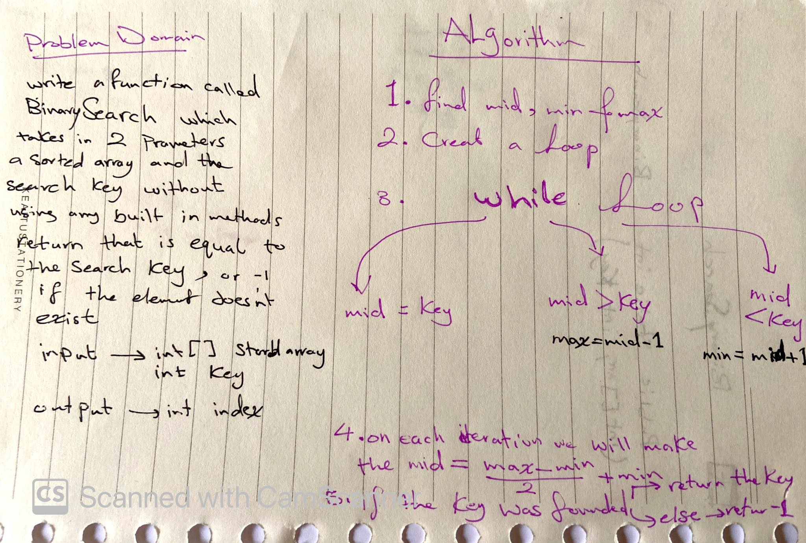
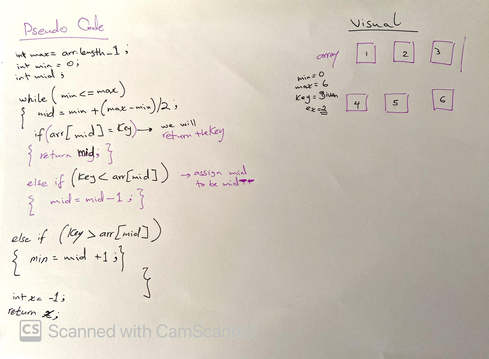

# array-binary-search
Challenge
Write a function called BinarySearch which takes in 2 parameters: a sorted array and the search key. Without utilizing any of the built-in methods available to your language, return the index of the array’s element that is equal to the search key, or -1 if the element does not exist.

# Approach & Efficiency

* get the min, max, and mid index of the given array
* we have to create a while loop to iterate through  the array with initial values of the min , max , and mid 
* we check inside the loop about the key if the elem of the mid = key 
we will return the mid so it's the solution .

* if key < element of the mid we will decrement the max by 1 .
* if the key > element of the mid  we will decrement the min by 1. 

out side the loop we will return -1 if the key was not found .

# solution 

