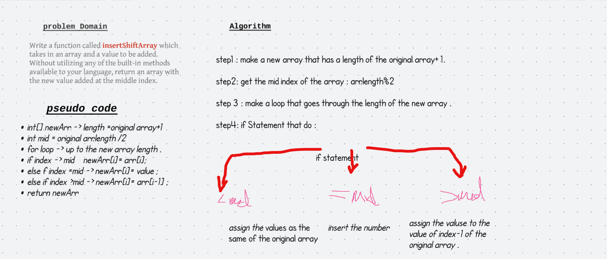
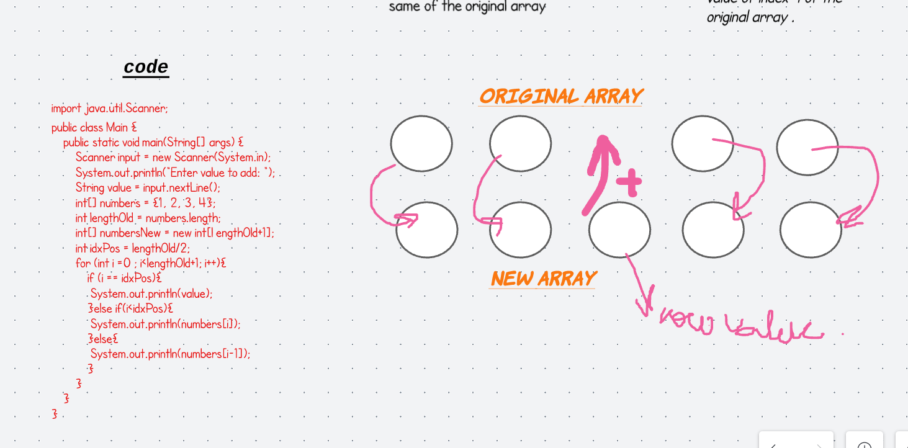

# shift Array 

## Challenge
Write a function called insertShiftArray which takes in an array and the value to be added. Without utilizing any of the built-in methods available to your language, return an array with the new value added at the middle index.

## Approach & Efficiency
My apporach was to create a new array 1 element more than the length of the passed in array. I also created an integer variable to store the middle index, dividing length to half. After creating a new array with the proper length for the shift, I looped through the array assigning the same values as the values on the same index of the passed in array for up to half its length. On current index in loop equalling to the middle index, I assign the passed in integer parameter. In continuation, the rest of the array will be assigned same as the values on the passed in array but setting its index minus 1 to accomodate the inserted middle element. This has a time-complexity of O(n) because of its linear approach.

## Solution : 

## the Code 

