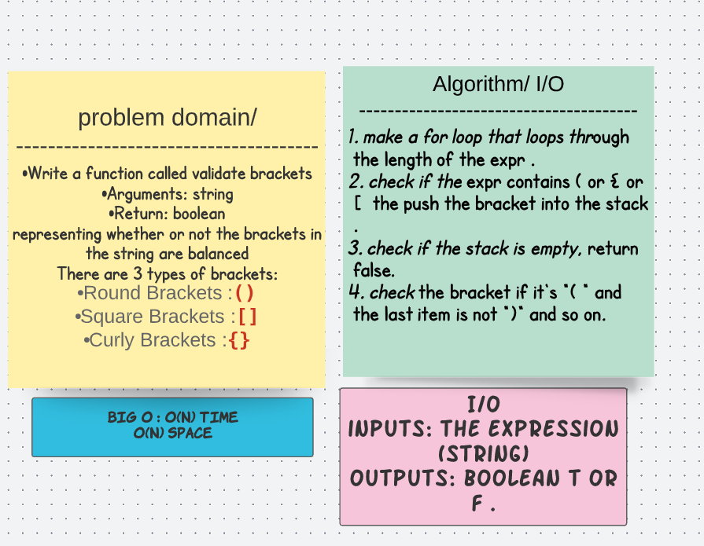
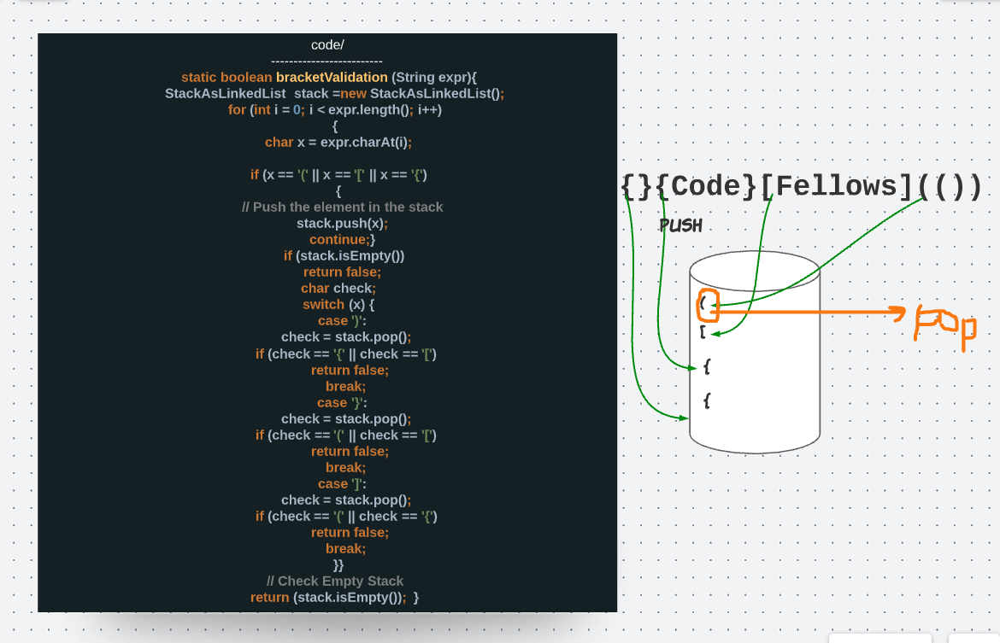

# Bracket Validation 
## challenge 
Write a function called validate brackets
Arguments: string
Return: boolean
representing whether or not the brackets in the string are balanced
There are 3 types of brackets:

Round Brackets : ()
Square Brackets : []
Curly Brackets : {}

## solution 

## Tests 
class bracketTest {

  @Test
  public  void bracketValidationTest(){
      
    String expr = "{}{Code}[Fellows](())";
    BracketBalance s1 = new BracketBalance();
    System.out.println(s1.bracketValidation(expr));

  }
}