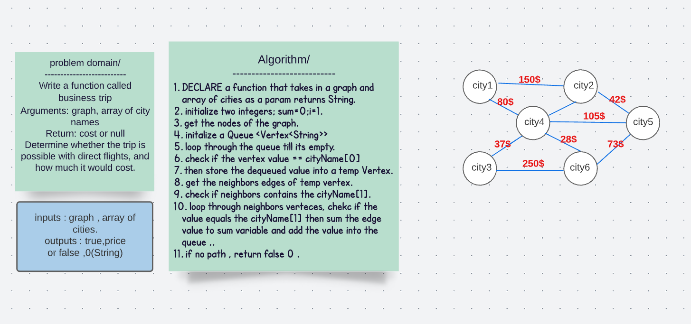

# Business Trip 

## Challenge 
Write a function called business trip
Arguments: graph, array of city names
Return: cost or null
Determine whether the trip is possible with direct flights, and how much it would cost.

## Solution 

## Code 
public String tripCost(Graph<String> graph, ArrayList<String> cityNames){

    int i = 1;
    int sum=0;

    Queue<Vertex<String>> queue = new LinkedList<>();
    Set<Vertex<String>> vertices = graph.getNodes();
    for (Vertex<String> vertex:
      vertices) {
      if (vertex.getValue().equals(cityNames.get(0))) {
        queue.add(vertex);
        while (!queue.isEmpty()){
          Vertex<String> temp = queue.poll();
          Map<Vertex<String>,Integer> edges = graph.getNeighbors(temp);
          if (contains(edges ,cityNames.get(i))) {
            for (Vertex<String> key :
              edges.keySet()) {
              if (key.getValue().equals(cityNames.get(i))) {
                sum += edges.get(key);
                queue.add(key);
                break;
              }
            }
          }else {
            return "FALSE, 0";
          }
          if (i == cityNames.size()-1) {
            break;
          }else {
            i++;
          }
        }
      }
    }
    return "TRUE, "+ sum;
  }

## Approach and Efficiency 
O(n^2) for time 
O(n) for space 

## edge cases 
if there is no path (edges)

## Tests
 @Test  void tripCostTest(){

    graphs.Graph< String> graph = new graphs.Graph<>();
    Vertex< String> v1=  graph.addNode("Mariam");
  Vertex< String> v2=graph.addNode("Sara");
  Vertex< String> v3=graph.addNode( "Lora");
  Vertex< String> v4=graph.addNode( "Yousef");

graph.addEdge(v1,v4,150);
graph.addEdge(v1,v2,60);
graph.addEdge(v2,v3,40);
ArrayList < String> cityNames= new ArrayList<>();
cityNames.add("Mariam");
cityNames.add("Yousef");

assertEquals("TRUE, 150",graph.tripCost(graph,cityNames));
  }

  @Test  void tripCostTest(){
      
    graphs.Graph<String> graph = new graphs.Graph<>();
    Vertex<String> v1=  graph.addNode("Mariam");
  Vertex<String> v2=graph.addNode("Sara");
  Vertex<String> v3=graph.addNode( "Lora");
  Vertex<String> v4=graph.addNode( "Yousef");

graph.addEdge(v1,v4,150);
graph.addEdge(v1,v2,60);
graph.addEdge(v2,v3,40);
ArrayList <String> cityNames= new ArrayList<>();
cityNames.add("Mariam");
cityNames.add("Lora");

assertEquals("FALSE, 0",graph.tripCost(graph,cityNames));
  }

