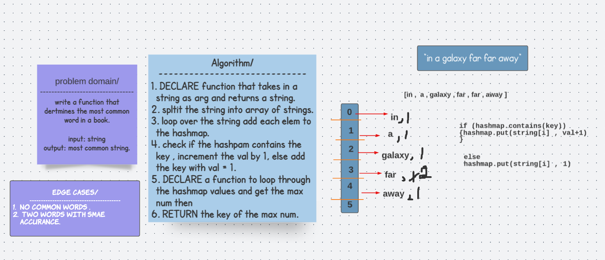

# Common Word 
## Challenge 
write a function that determines the most common word in a book.

## Solution 

## Code 
public class CommonWord {

       private int tempCounter=0;
       private String tempWord="";
  public String mostCommonWord(String string) throws Exception {
    String[] arrString = string.split(" ");
    HashTable<
    String, Integer> hashMap = new HashTable<>();
    for (String str : arrString) {
        
      if (hashMap.contains(str) && !str.isEmpty()) {
        hashMap.add(str, hashMap.get(str) + 1);
        if (hashMap.get(str)>tempCounter){ tempCounter=hashMap.get(str);
        tempWord=str;
        }
      }
      else {
        hashMap.add(str, 1);
      }
    }
    return tempWord;}

 ## Approach and Efficiency 
 Big(O) ----> O(n) for time and O(n) for space in the worst case.

 ## Tests

  @Test
    void commonWord() throws Exception {

      CommonWord newInstance= new CommonWord();
      String str= "we are far far away from each other";
      String expected = newInstance.mostCommonWord(str);
      assertEquals("far" ,expected );
    }

    @Test
    void NocommonWord() throws Exception {

      CommonWord newInstance= new CommonWord();
      String str= "we are far away from each other";
      String expected = newInstance.mostCommonWord(str);
      assertEquals("" ,expected );
    }

    @Test
    void moreCommonWord() throws Exception {

      CommonWord newInstance= new CommonWord();
      String str= "we are far far away from from  each other";
      String expected = newInstance.mostCommonWord(str);
      assertEquals("far" ,expected );
    }