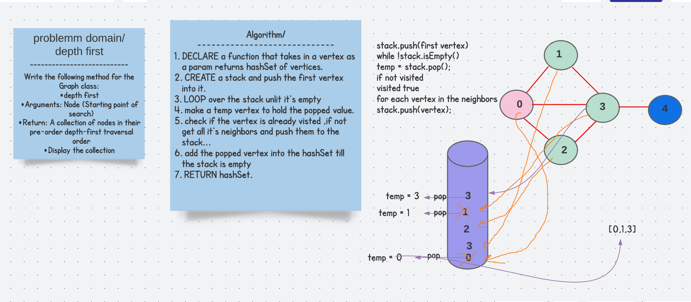

# Depth First traversal of graphs

## Challenge 
Write the following method for the Graph class:

depth first
Arguments: Node (Starting point of search)
Return: A collection of nodes in their pre-order depth-first traversal order
Display the collection

## Solution 

## code 
  public HashSet <Vertex<String>> depthFirst(Vertex<String> vertex){

    Map<Vertex<K>,Integer> neighbors;
    Stack<Vertex<String >> stack = new Stack<>();
    HashSet<Vertex<String>> visited = new LinkedHashSet<>();
    stack.push(vertex);
    visited.add(vertex);
    while (!stack.isEmpty()){

      Vertex<String> temp = stack.pop();

      neighbors= getNeighbors((Vertex<K>) temp);
      for (Vertex node:neighbors.keySet() ){

        if (!visited.contains(node))
        {stack.push(node);
          visited.add(node);
        }}}
    Iterator<Vertex<String>> iterator= visited.iterator();
    while (iterator.hasNext()) System.out.println(iterator.next().getValue());
    return visited;
  }

## Approach and Effifeincy 
 O(V+E) where V is the number of vertexes and E is the number of edges
## Edge cases 
* graph has one vertex
## Tests 
