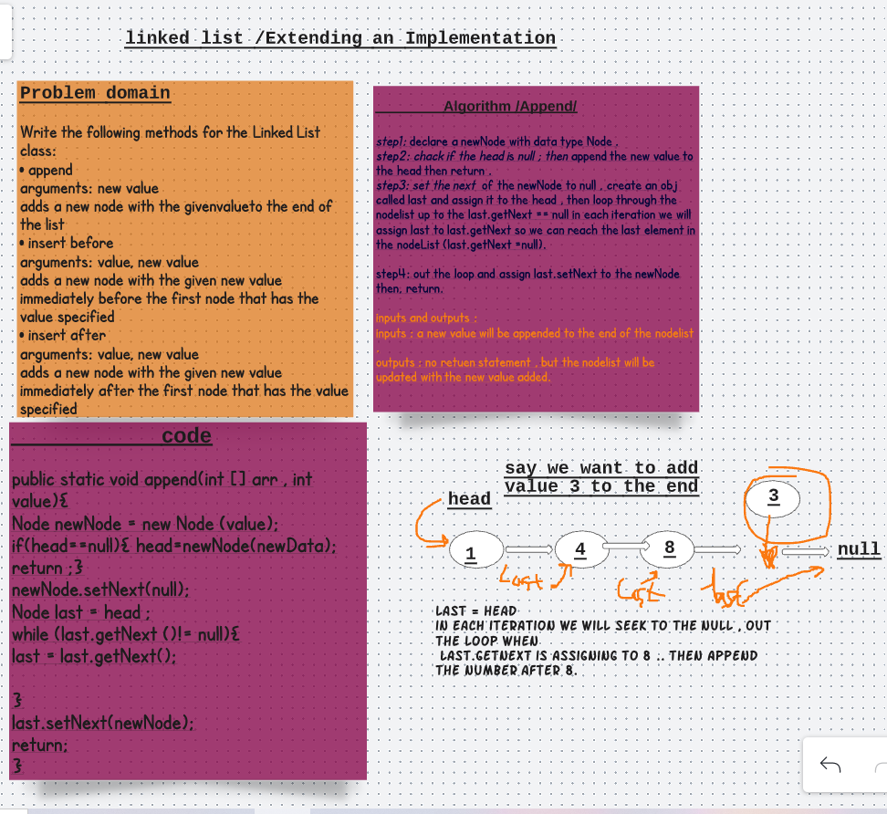
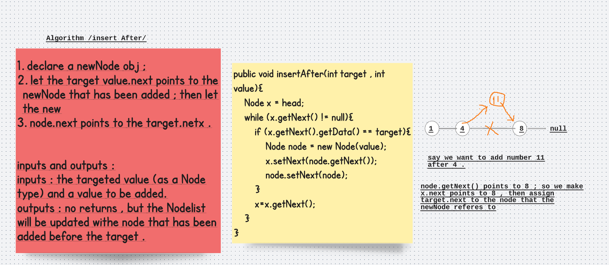
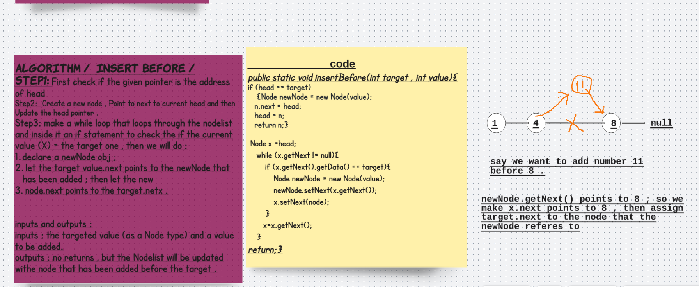

# Extension of Node list -Single Node list 
# Challenge Summary
Write the following methods for the Linked List class:

append
arguments: new value
adds a new node with the given value to the end of the list
insert before
arguments: value, new value
adds a new node with the given new value immediately before the first node that has the value specified
insert after
arguments: value, new value
adds a new node with the given new value immediately after the first node that has the value specified

## Whiteboard Process
## Big O : space **O(n)**
## Edge Cases: 
* **insertBefore to null linkedList {empty}**
* **insertAfter null** 

## Test
class NewTest {
  @Test
  public void insertAfterTest(){

     LinkedList list = new LinkedList();
    list.append(2);
    list.append(4);
    list.append(6);
    list.insertAfter(2,11);
    Node scanner = list.getHead();
    ArrayList arrayList = new ArrayList();
    while(scanner != null){
      arrayList.add(scanner.getData());
      scanner = scanner.getNext();
      }
   int x = (int) arrayList.get(1);

    assertEquals(11,x);
  }

  public void insertBeforeTest(){

    LinkedList list = new LinkedList();
    list.append(2);
    list.append(4);
    list.append(6);
    list.insertBefore(4,11);
    Node scanner = list.getHead();
    ArrayList arrayList = new ArrayList();
    while(scanner != null){
      arrayList.add(scanner.getData());
      scanner = scanner.getNext();
    }
    int x = (int) arrayList.get(1);

    assertEquals(11,x);
  }

  public void insertAppendTest(){

    LinkedList list = new LinkedList();
    list.append(2);
    list.append(4);
    list.append(6);
    Node scanner = list.getHead();
    ArrayList arrayList = new ArrayList();
    while(scanner != null){
      arrayList.add(scanner.getData());
      scanner = scanner.getNext();
    }
    int x = (int) arrayList.get(0);
    int y = (int) arrayList.get(1);
    int z = (int) arrayList.get(2);

    assertEquals(2,x);
    assertEquals(4,x);
    assertEquals(6,x);
  }

}

