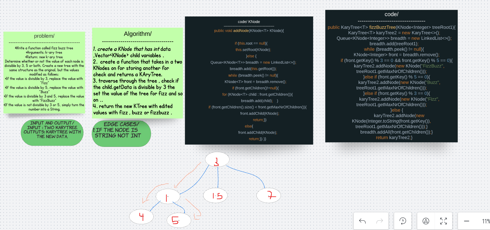

# Challenge 
Write a function called fizz buzz tree
Arguments: k-ary tree
Return: new k-ary tree
Determine whether or not the value of each node is divisible by 3, 5 or both. Create a new tree with the same structure as the original, but the values modified as follows:

If the value is divisible by 3, replace the value with “Fizz”
If the value is divisible by 5, replace the value with “Buzz”
If the value is divisible by 3 and 5, replace the value with “FizzBuzz”
If the value is not divisible by 3 or 5, simply turn the number into a String.

# solution 

# Big O 
**O(n^2)**

# Test 
class karyTree{
    KaryTree< Integer> karyTree = new KaryTree< Integer>(new KNode< Integer>(1, 3));

    @BeforeEach
    void init() {

        karyTree.addNode(new KNode<>(2, 3));
        karyTree.addNode(new KNode<>(3, 3));
        karyTree.addNode(new KNode<>(4, 3));
        karyTree.addNode(new KNode<>(5, 3));
        karyTree.addNode(new KNode<>(6, 3));
        karyTree.addNode(new KNode<>(15, 3));
        karyTree.addNode(new KNode<>(8, 3));
    }

    @Test
    void fizzBuzzTest1(){

        assertEquals("1",karyTree.fizzBuzzTree(karyTree.getRoot()).getRoot().getKey());
    }
}
