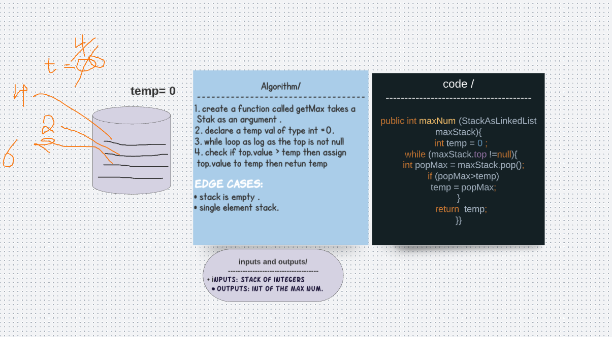

# Max num of the Stack 

# Challenge 
## Max stack. Write a method that returns the “biggest” element in a stack.

# solution 

## Big O :
**O(n) time O(1) space .**

## Tests 

class MaxValTest {

  @Test
  public  void  maxValTesting (){
      
    StackAsLinkedList s1 = new StackAsLinkedList() ;
    s1.push(2);
    s1.push(4);
    s1.push(26);
    s1.push(6);
    s1.push(8);
    s1.push(11);
    maxStack m = new maxStack();
    int x = m.maxNum(s1);
    assertEquals(26,x);
  }
}
