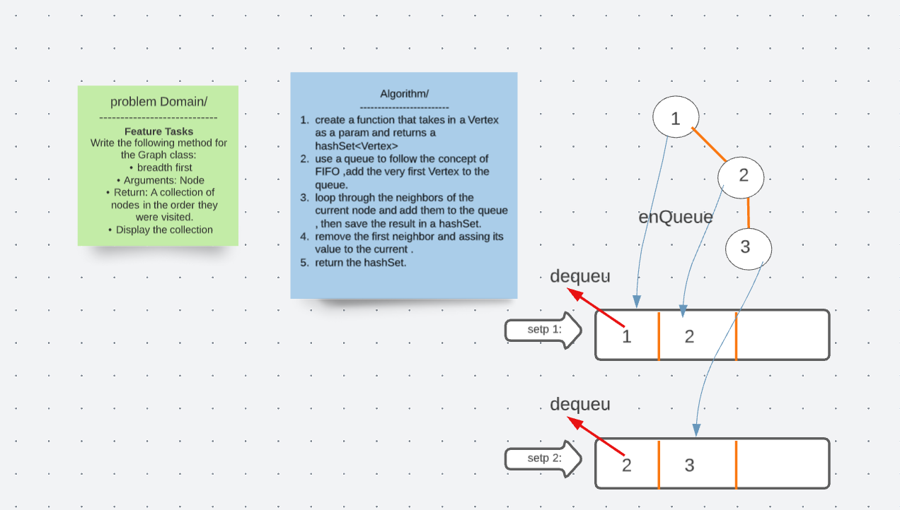

# Graph traversal/ Breadth first

## Challenge 
Write the following method for the Graph class:

breadth first
Arguments: Node
Return: A collection of nodes in the order they were visited.
Display the collection.

## Solution 

## Code 

  public HashSet<Vertex<String>> breadthFirst(Vertex<String> vertex){

    Map<Vertex<K>,Integer> neighbors= getNeighbors((Vertex<K>) vertex);
    Queue<Vertex<String>> queue = new LinkedList<>();
    HashSet<Vertex<String>> visited = new HashSet<>();
    queue.add(vertex);
    while (!queue.isEmpty()){
      Vertex<String> curr= queue.remove();

    for (Vertex vert: getNeighbors((Vertex<K>) curr).keySet()){

      if (!visited.contains(vert))
      {queue.add(vert);
        visited.add(vert);
        System.out.println(">>>--neighbors value--<<<"+vert.getValue());
      }

    }

    }
    return visited;

  }

## Approach and Efficeincy 

O(V+E) for time , where V is the num of vertices and E is num of edges.
## Edge cases 
* **only on node in the graph.** 

## Tests

 @Test
    void breadthFirstTraversalTest(){
        
    graphs.Graph<String> graph = new graphs.Graph<>();
    Vertex<String> vertex1 = graph.addNode("1");
    Vertex<String> vertex2 = graph.addNode("2");
    Vertex<String> vertexA = graph.addNode("3");
    Vertex<String> vertex3 = graph.addNode("4");
    //add edges to the vertex
    graph.addEdge(vertex1,vertex2,1);
    graph.addEdge(vertex1,vertexA,3);
    graph.addEdge(vertex2,vertex3,2);
    graph.addEdge(vertex3,vertex2,2);
ArrayList <String>arr= new ArrayList<>();
HashSet<Vertex<String>> res= graph.breadthFirst(vertex1);
    for(Vertex<String> node: res){
      arr.add(node.getValue());

    }
    assertEquals("[1, 2, 3, 4]", arr.toString());
  }