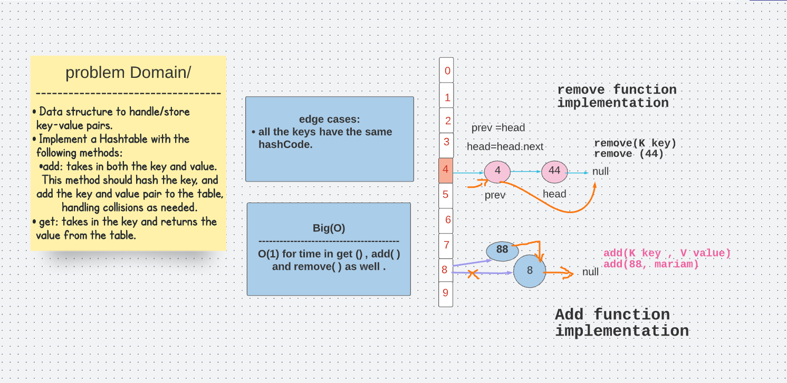

# Hash Table 
Data structure to handle/store key-value pairs.

## Challenge
Implement a Hashtable with the following methods:

* add: takes in both the key and value. This method should hash the key, and add the key and value pair to the table, handling collisions as needed.
* get: takes in the key and returns the value from the table.

## Approach & Efficiency (BigO)
* add: My approach was to check first if there will be a collision (same key) and handle appropriately the addition of the new key-value 
pair. Time complexity is O(1).

* get: My approach was to return the value of the given key after using the hash function to check the map. Time compexity is O(1).

* hash: Time complexity is O(1).

*  contains: My approach is to first use the hash function to hash the given key and use it to check the map if it returns not null. Time complexity is O(1).

## API
    * public void add(K key, V value)

    * public String get(K key)

    * publice remove(K key )

 ## Solution 
 

## Code 

## Node 
public class HashNode <
K, V>{
  K key ;

  V value ;
  final int hashCode;
  HashNode<
  K, V> next;

  public HashNode(K key, V value, int hashCode) {

    this.key = key;
    this.value = value;
    this.hashCode = hashCode;
  }

  public HashNode<K, V> getNext() {

    return next;
  }

  public void setNext(HashNode<K, V> next) {

    this.next = next;
  }
}
 
 ## hashTable class 

public class HashTable< K, V> {

private ArrayList< HashNode< K,V>> bucketArray ;
private int numBuckets;
  // size of the array
private int size;

  public HashTable() {
    this.bucketArray = new ArrayList<>();
    this.numBuckets = 10;
    this.size = 0;
    for (int i = 0 ; i< numBuckets; i++){
      this.bucketArray.add(null);
    }
  }

  public int size() {

    return size;
  }
  boolean isEmpty(){

    return size()==0;
  }

// to get the hashCode of the key value :
  private final int hashCode(K key){
  return   Objects.hashCode(key);
  }

  private int getBucketIndex(K key){

    int hashCode= hashCode(key);
    int index = hashCode% numBuckets;
    // for negative hashCodes :
    index = index<0 ? index*-1 : index;
    return index;
  }

  public V remove (K key ){

    int bucketIdx= getBucketIndex(key);
    int hashCode= hashCode(key);
    HashNode<K,V> head = bucketArray.get(bucketIdx);
    HashNode<K,V > prev = null;
    while (head!=null){
      if (hashCode==head.hashCode && head.key.equals(key)) break;
      prev=head;
      head=head.getNext();
    }
    if (head == null)
      return null;
    size--;
    if (prev!=null){prev.setNext(head.getNext());}
    else  bucketArray.set(bucketIdx, head.getNext());
    return head.value;
  }

  public void add(K key , V value){

    int bucketIdx = getBucketIndex(key);
    int hashCode = hashCode(key);
    HashNode<K , V> head= bucketArray.get(bucketIdx);
    // in case the key was already added we check the key then add the value .
    while (head!=null)
    { if (head.key.equals(key) && key.hashCode()==hashCode){
      head.value=value;
      return;}
      head=head.getNext();
    }
    size++;
    // in case the key was not inserted , then create new bucket to the new key :
    head=bucketArray.get(bucketIdx);
    HashNode<K , V > newNode = new HashNode<>(key,value,hashCode);
    newNode.next=head;
    bucketArray.set(bucketIdx,newNode);

    if ((1.0 * size) / numBuckets >= 0.7) {

      ArrayList<HashNode<K, V> > temp = bucketArray;
      bucketArray = new ArrayList<>();
      numBuckets = 2 * numBuckets;
      size = 0;
      for (int i = 0; i < numBuckets; i++)
        bucketArray.add(null);

      for (HashNode<K, V> headNode : temp) {

        while (headNode != null) {
          add(headNode.key, headNode.value);
          headNode = headNode.next;}}}
  }

  public V get(K key)
  {

   // get the head of the linkedlist chain :
    int bucketIndex = getBucketIndex(key);
    int hashCode = hashCode(key);

    HashNode<K, V> head = bucketArray.get(bucketIndex);

    // Search key in chain
    while (head != null) {

      if (head.key.equals(key) && head.hashCode == hashCode)
        return head.value;
      head = head.next;
    }
    // in case there was no key found : 
    return null;
  }

  public boolean contains(K key)
    throws Exception
  {
    try
    {
      get(key);
      return true;
    }
    catch (Exception e)
    {
      return false;
    }
  }

}

## Tests 
class HashTableTests{
  @Test
  void addTest(){
    HashTable<String,Integer> hashTable= new HashTable<>();
    hashTable.add("Mariam" , 811);
    Integer key = hashTable.get("Mariam");

    assertEquals(811 ,key);

  }

  @Test
  void getTest(){

    HashTable<String,Integer> hashTable= new HashTable<>();
    hashTable.add("Mariam" , 811);
    Integer key = hashTable.get("Mariam");

    assertEquals(811 ,key);
  }

  @Test
  void removeTest(){

    HashTable<String,Integer> hashTable= new HashTable<>();
    hashTable.add("Mariam" , 811);

    assertEquals(811, hashTable.remove("Mariam"));
    assertEquals(0 ,hashTable.size());
  }

  @Test
  void removeNotFoundKey(){

    HashTable<String,Integer> hashTable= new HashTable<>();
    hashTable.add("Mariam" , 811);

    assertEquals(null,hashTable.remove("sara") );
  }

  @Test
  void addSameKeyToHashTable(){

    HashTable<String,Integer> hashTable= new HashTable<>();
    hashTable.add("Mariam" , 811);
    hashTable.add("Mariam" , 12);
    assertEquals("12",hashTable.get("Mariam"));

  }

@Test
  void doesContain() throws Exception {
    HashTable< String,Integer> hashTable= new HashTable<>();
    hashTable.add("Mariam" , 811);
    hashTable.add("Sara" , 811);
    hashTable.add("Yousef" , 811);
    assertEquals(false,hashTable.contains("Yousef"));
  }

}

