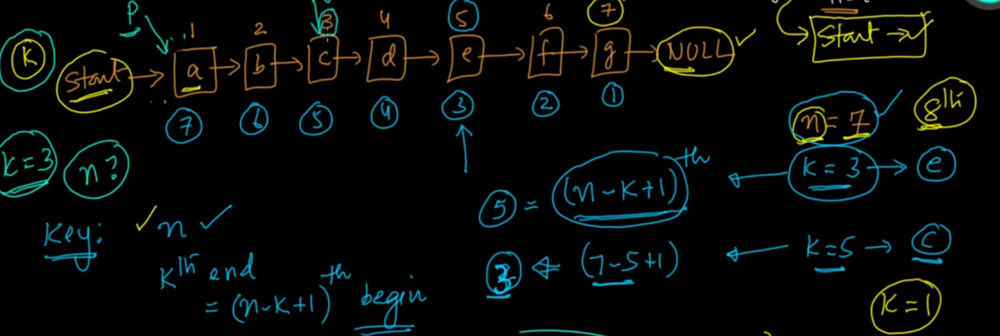
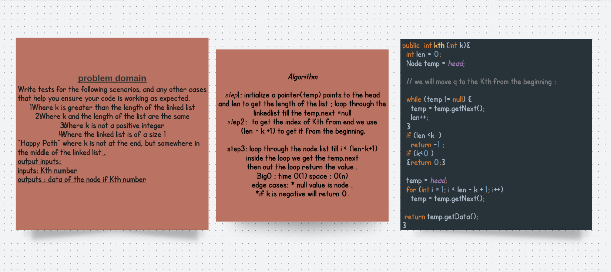

 # Challenge 
 Write the following method for the Linked List class:

kth from end
argument: a number, k, as a parameter.
Return the node’s value that is k places from the tail of the linked list.
You have access to the Node class and all the properties on the Linked List class as well as the methods created in previous challenges.

# Solution
# Visual and Code 

# Test 
 ## test1 
  LinkedList link1 = new LinkedList();
    @Test void kthGreaterThanLn() {

      link1.insert(2);
      link1.append(2);
      link1.append(3);
      link1.append(5);
    int x=  link1.kth(5);
      int expected = -1 ;
      assertEquals(expected ,x);

    }

## test2 
 @Test void kthEqualsLen(){

      link1.insert(2);
      link1.append(2);
      link1.append(3);
      link1.append(5);
      int exp = 2;
      int x=  link1.kth(4);
      assertEquals(exp,x);

    }

## Test3 

@Test void negativeKth(){

      link1.insert(2);
      link1.append(2);
      link1.append(3);
      link1.append(5);
      int exp = 0;
      int x=  link1.kth(-1);
      assertEquals(exp,x);
    }
 

## Test4 
 @Test void happyPath(){
    link1.insert(2);
    link1.append(2);
    link1.append(3);
    link1.append(5);
    link1.append(9);
    int exp = 3;
    int x=  link1.kth(3);
    assertEquals(exp,x);
  }

 

## test 5 
@Test void sizeOne(){
    link1.insert(2);

    int exp = 2;
    int x=  link1.kth(1);
    assertEquals(exp,x);
  }
