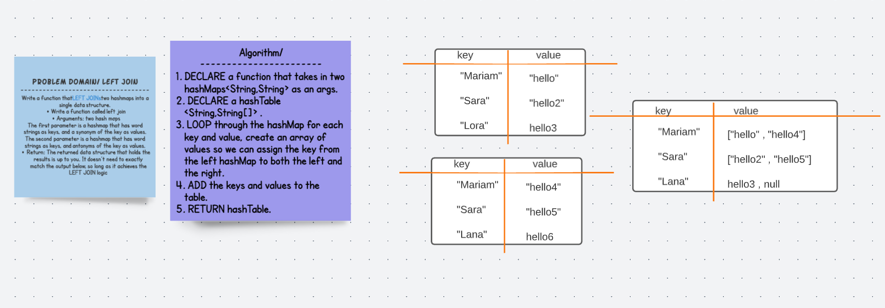

# Left Join 
## Challenge 
Write a function that LEFT JOINs two hashmaps into a single data structure.

Write a function called left join
Arguments: two hash maps
The first parameter is a hashmap that has word strings as keys, and a synonym of the key as values.
The second parameter is a hashmap that has word strings as keys, and antonyms of the key as values.
Return: The returned data structure that holds the results is up to you. It doesn’t need to exactly match the output below, so long as it achieves the LEFT JOIN logic
NOTES:

Combine the key and corresponding values (if they exist) into a new data structure according to LEFT JOIN logic.
LEFT JOIN means all the values in the first hashmap are returned, and if values exist in the “right” hashmap, they are appended to the result row.
If no values exist in the right hashmap, then some flavor of NULL should be appended to the result row.

## Solution 

## Code 

  public static HashTable< String,String[]> leftJoin(HashMap< String, String> synonyms, HashMap< String, String> antonymns){
      

    HashTable <String,String[]> haaash1= new HashTable<String,String[]>();
    synonyms.forEach((key,value)->{
      String[] values= new String[2];
      values[0]=value;
      values[1]=antonymns.get(key);
      haaash1.add(key,values);

    });
    return haaash1;

  }

##  Approach & Efficiency
My approach was to use a Hashtable to store the left join of the 2 hash maps. I used the left hashmap in my foreach, adding the hashmap key to a key in my hashtable. I used a String array to store the values of the hashmaps. Time complexity is linear O(n) and space complexity is linear O(n) because of the created hashtable for the output.

## API
    public static Hashtable<String,String[]> leftJoin(HashMap<String,String> synonyms, HashMap<String,String> antony

## Edge cases 
    * empty hash map 

## Tests 

