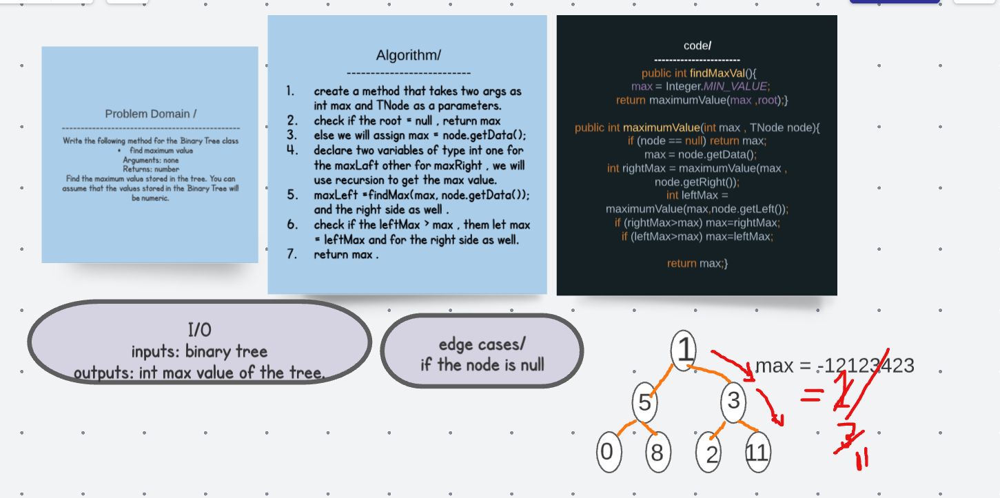

# Challenge 
Write the following method for the Binary Tree class

find maximum value
Arguments: none
Returns: number
Find the maximum value stored in the tree. You can assume that the values stored in the Binary Tree will be numeric.

## Solution 

## Big O 
big(O) space : O(1)
time O(w) , where W is the width. 

## Tests 
@Test
  public void maxValTest (){
      
    TNode node = new TNode(2);
    BinaryTree binaryTree= new BinaryTree(node);
    node.setRight(new TNode(4));
    node.setLeft(new TNode(9));
    node.getLeft().setRight(new TNode(11));
    node.getLeft().setLeft(new TNode(14));
    node.getRight().setRight(new TNode(1));
    node.getRight().setLeft(new TNode(50));

    assertEquals(50,    binaryTree.findMaxVal());
  }
