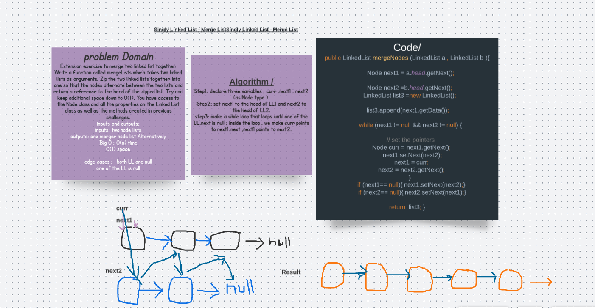

# Zip two linked lists.
## challenge 
Write a function called zip lists
Arguments: 2 linked lists
Return: Linked List, zipped as noted below
Zip the two linked lists together into one so that the nodes alternate between the two lists and return a reference to the head of the zipped list.
Try and keep additional space down to O(1)
You have access to the Node class and all the properties on the Linked List class as well as the methods created in previous challenges.

## Tests
 @Test
  public void testmergeLinkedList(){
      
    LinkedList linkedList1 = new LinkedList();

    linkedList1.insert(8);
    linkedList1.insert(6);
    linkedList1.insert(4);
    linkedList1.insert(2);

    LinkedList linkedList2 = new LinkedList();

    linkedList2.insert(7);
    linkedList2.insert(5);
    linkedList2.insert(3);

    LinkedList res = LinkedList.mergeNodes(linkedList1,linkedList2);

    assertEquals("2\n" +
      "3\n" +
      "4\n" +
      "5\n" +
      "6\n" +
      "7\n" +
      "8\n",res.toString());

  }