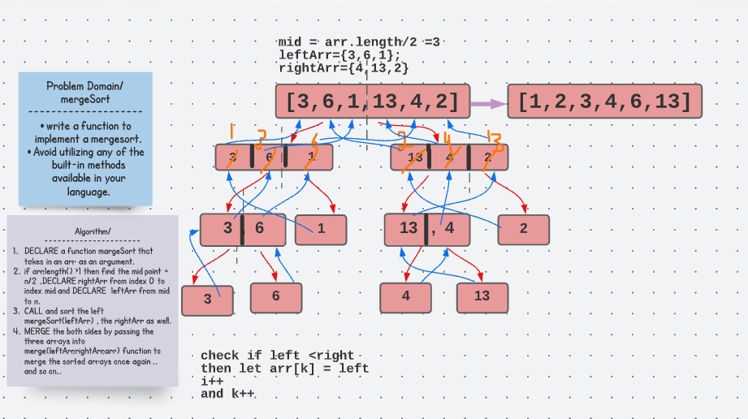

#  Merge Sort Interview Challenge 
write a function to implement a mergesort.
Avoid utilizing any of the built-in methods available in your language.

## Solution 

## Code 
public class MergeSort {

  public  void mergeSort(int[] arr){

    int n = arr.length;
    if(n>1){
      int mid = n/2 ;
      int[] left=Arrays.copyOfRange(arr,0,mid) ;
      int[] right = Arrays.copyOfRange(arr,mid,n);
      mergeSort(left);
      mergeSort(right);
      merge(left ,right,arr);
    }

  }

  public void merge(int[] left , int[] right , int[] arr){

    int i =0 ;
    int j =0 ;
    int k =0 ;
    while (i<left.length && j <right.length){
      if (left[i] <right[j])
      { arr[k] =left[i];
        i++; }
      else {
        arr[k] = right[j];
        j++;
      }
      k++; }
      while (i< left.length){
        arr[k]=left[i];
        i++; k++;
      }
     while (j<right.length){
       arr[k]=right[j];
       j++; k++; }
  }
}

## Test

  @Test
  void mergeSort(){

    MergeSort mergeSort = new MergeSort();
    int arr[] = {8,4,23,42,16,15};

 mergeSort.mergeSort(arr);
   String res = Arrays.toString(arr);
    assertEquals("[4, 8, 15, 16, 23, 42]" , res);
  }

## Big(O)
O(n) for space 
O(nlogn ) for time for worst case. 

## Egde Cases
**empty array** 