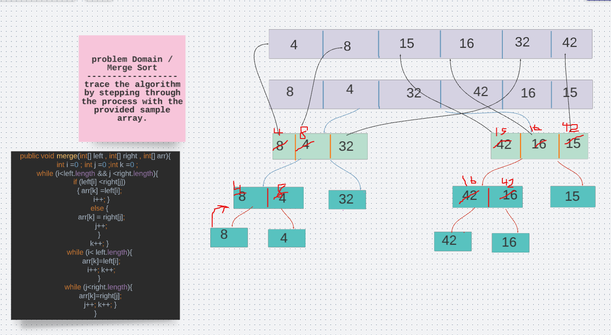

# Challenge 
**Merge Sort**
Review the pseudocode below, then trace the algorithm by stepping through the process with the provided sample array. Document your explanation by creating a blog article that shows the step-by-step output after each iteration through some sort of visual.

Once you are done with your article, code a working, tested implementation of Merge Sort based on the pseudocode provided.

Pseudo Code

ALGORITHM Mergesort(arr)
    DECLARE n <-- arr.length

    if n > 1
      DECLARE mid <-- n/2
      DECLARE left <-- arr[0...mid]
      DECLARE right <-- arr[mid...n]
      // sort the left side
      Mergesort(left)
      // sort the right side
      Mergesort(right)
      // merge the sorted left and right sides together
      Merge(left, right, arr)

ALGORITHM Merge(left, right, arr)
    DECLARE i <-- 0
    DECLARE j <-- 0
    DECLARE k <-- 0

    while i < left.length && j < right.length
        if left[i] <= right[j]
            arr[k] <-- left[i]
            i <-- i + 1
        else
            arr[k] <-- right[j]
            j <-- j + 1

        k <-- k + 1

    if i = left.length
       set remaining entries in arr to remaining values in right
    else
       set remaining entries in arr to remaining values in left

Sample Arrays
In your blog article, visually show the output of processing this input array:

[ 8,4,23,42,16,15]

# Solution 

## Code 
public class MergeSort {

  public  void mergeSort(int[] arr){

    int n = arr.length;
    if(n>1){
      int mid = n/2 ;
      int[] left=Arrays.copyOfRange(arr,0,mid) ;
      int[] right = Arrays.copyOfRange(arr,mid,n);
      mergeSort(left);
      mergeSort(right);
      merge(left ,right,arr);
    }

  }

  public void merge(int[] left , int[] right , int[] arr){

    int i =0 ;
    int j =0 ;
    int k =0 ;
    while (i<left.length && j <right.length){
      if (left[i] <right[j])
      { arr[k] =left[i];
        i++; }
      else {
        arr[k] = right[j];
        j++;
      }
      k++; }
      while (i< left.length){
        arr[k]=left[i];
        i++; k++;
      }
     while (j<right.length){
       arr[k]=right[j];
       j++; k++; }
  }
}

## Test

  @Test
  void mergeSort(){

    MergeSort mergeSort = new MergeSort();
    int arr[] = {8,4,23,42,16,15};

 mergeSort.mergeSort(arr);
   String res = Arrays.toString(arr);
    assertEquals("[4, 8, 15, 16, 23, 42]" , res);
  }

## Big(O)
O(n) for space 
O(nlogn ) for time

## Egde Cases
**empty array** 