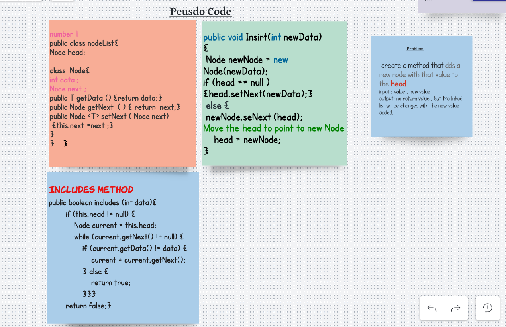

# Singly Linked Lists

## Challenge 
Node
Create a Node class that has properties for the value stored in the Node, and a pointer to the next Node.
Linked List
Create a Linked List class
Within your Linked List class, include a head property.
Upon instantiation, an empty Linked List should be created.
The class should contain the following methods
insert
Arguments: value
Returns: nothing
Adds a new node with that value to the head of the list with an O(1) Time performance.

## solution , step 1 :

## in this photo 22 in the beginneing is written by fault , it must be 30 .

## Visual & Algorithm of Includes method:
## Big O : space O(n)

## toString method :

## Tests 
public class AppTest11 {

    @Test
    public void testLinkedListInstantiation(){

      LinkedList linkedList = new LinkedList();
      assertEquals(null,linkedList.getHead());
    }

    @Test
    public void testLinkedListInsert(){

      LinkedList linkedList = new LinkedList();
      linkedList.insert(1);

      assertEquals(1,linkedList.getHead().getData());

      linkedList.insert(2);
      Node temp = linkedList.getHead();
      linkedList.insert(3);

      assertEquals(temp,linkedList.getHead().getNext());
    }

    @Test
    public void testLinkedListPrint() {

      LinkedList linkedList = new LinkedList();

      linkedList.insert(1);
      linkedList.insert(2);
      linkedList.insert(3);

      ArrayList<Integer> res = linkedList.print();

      ArrayList expected = new ArrayList<>();
      expected.add(3);
      expected.add(2);
      expected.add(1);

      assertEquals(expected.size(),res.size());
      assertEquals(expected,res);

    }

    @Test
    public void testLinkedListIncludesTrue() {
      

      LinkedList linkedList = new LinkedList();

      linkedList.insert(1);
      linkedList.insert(2);
      linkedList.insert(3);

      assertTrue(linkedList.include(2),
        "testing linked list is true: ");

    }

    
}
