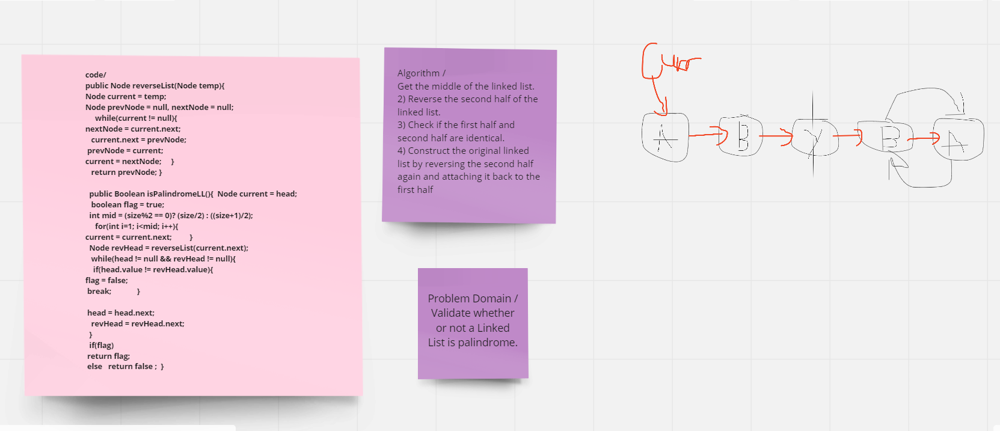

# Challenge 
## Problem Domain /
Validate whether or not a Linked List is palindrome.

## solution 
Algorithm /
Get the middle of the linked list.
2) Reverse the second half of the linked list.
3) Check if the first half and second half are identical.
4) Construct the original linked list by reversing the second half again and attaching it back to the first half.
# Big O : O(n) time 
## Outputs and inputs :
# inputs : Node of the linked list 
outputs : Boolean , if it's true or false .

