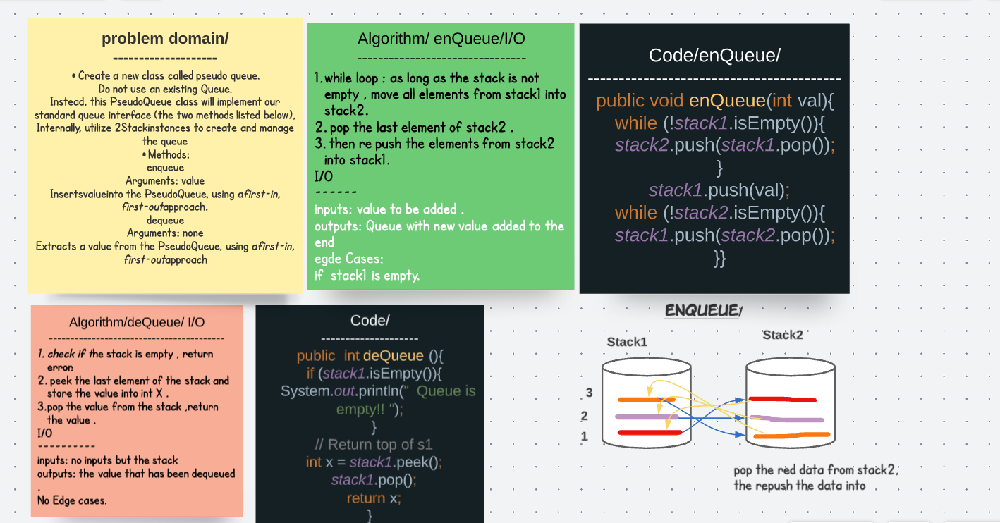

# Implement a Queue using two Stacks.

## Challenge /
Create a new class called pseudo queue.
Do not use an existing Queue.
Instead, this PseudoQueue class will implement our standard queue interface (the two methods listed below),
Internally, utilize 2 Stack instances to create and manage the queue
Methods:
enqueue
Arguments: value
Inserts value into the PseudoQueue, using a first-in, first-out approach.
dequeue
Arguments: none
Extracts a value from the PseudoQueue, using a first-in, first-out approach.

## Solution

## Big(O)
## enqueue : O(n) time space O(1)
## deQueue : O(1) time and space 

# Tests 
class peusodoQueueTest{

  @Test void deQueueTest(){
      
    PseudoQueue q1= new PseudoQueue();
    q1.enQueue(28);
    q1.enQueue(7);
    q1.enQueue(11);
    assertEquals(q1.deQueue(),28);
  }

  @Test void enQueueTest(){

    PseudoQueue q1= new PseudoQueue();
    q1.enQueue(28);
    q1.enQueue(7);
    q1.enQueue(11);
    q1.deQueue();
    q1.deQueue();
assertEquals(q1.deQueue(),11);
  }
}