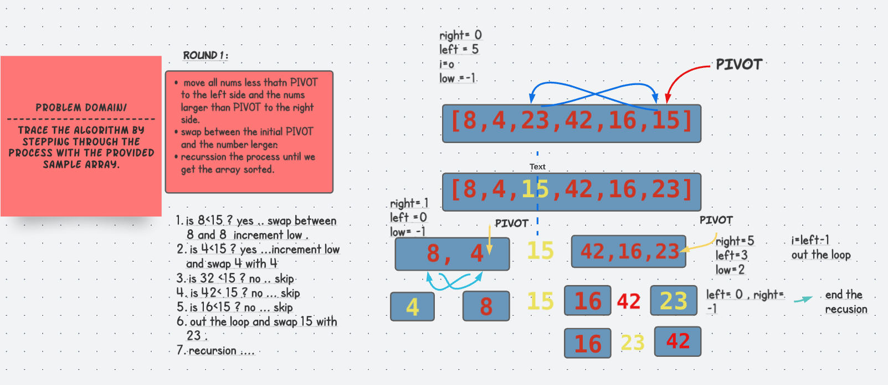

# Quick Sort Challenge 
trace the algorithm by stepping through the process with the provided sample array. Document your explanation by creating a blog article that shows the step-by-step output after each iteration through some sort of visual.

Once you are done with your article, code a working, tested implementation of Quick Sort based on the pseudocode provided.

You may review an example document HERE

Pseudo Code
ALGORITHM QuickSort(arr, left, right)
    if left < right
        // Partition the array by setting the position of the pivot value
        DEFINE position <-- Partition(arr, left, right)
        // Sort the left
        QuickSort(arr, left, position - 1)
        // Sort the right
        QuickSort(arr, position + 1, right)

ALGORITHM Partition(arr, left, right)
    // set a pivot value as a point of reference
    DEFINE pivot <-- arr[ right]
    // create a variable to track the largest index of numbers lower than the defined pivot
    DEFINE low <-- left - 1
    for i <- left to right do
        if arr[i] <= pivot
            low++
            Swap(arr, i, low)

     // place the value of the pivot location in the middle.
     // all numbers smaller than the pivot are on the left, larger on the right.
     Swap(arr, right, low + 1)
    // return the pivot index point
     return low + 1

ALGORITHM Swap(arr, i, low)
    DEFINE temp;
    temp <-- arr[ i]
    arr[ i] <-- arr[ low]
    arr[ low] <-- temp

## Solution 

## Code 
public class QuickSort {

  int[] arr = {8,4,23,42,16,15};
  static void swap(int[] arr, int i, int j) {

    int temp = arr[i];
    arr[i] = arr[j];
    arr[j] = temp;
  }

  static int partition(int[] arr, int left, int right) {

    int pivot = arr[right];

    int low = (left - 1);

    for (int i = left; i <= right - 1; i++) {

      if (arr[i] < pivot) {
        low++;
        swap(arr, low, i);
      }
    }
    swap(arr, low + 1, right);
    return (low + 1);
  }

  public static void quickSort(int[] arr, int left, int right) {

    if (left < right) {

      int position = partition(arr, left, right);

      quickSort(arr, left, position - 1);
      quickSort(arr, position + 1, right);
    }
  }
}

## Tests

@Test
  void quickSortTest(){

  int arr[] = {8,4,23,42,16,15};
  QuickSort quickSort=new QuickSort();
  quickSort.quickSort(arr,0,arr.length-1);

  String res= Arrays.toString(arr);
  assertEquals("[4, 8, 15, 16, 23, 42]",res);
}

@Test
  void newQuickTest(){

  int arr[] = {8,4,23,1,42,16,15};
  QuickSort quickSort=new QuickSort();
  quickSort.quickSort(arr,0,arr.length-1);

  String res= Arrays.toString(arr);
  assertEquals("[1, 4, 8, 15, 16, 23, 42]",res);
}

## Edge cases 
* arrays is empty.
* all nums are equal

## Big(O)
O(1) for space 
 O(nlogn) in worst case. 