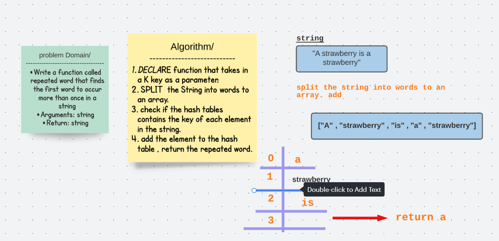

# Repeated word 
## Challenge 
Write a function called repeated word that finds the first word to occur more than once in a string
Arguments: string
Return: string

## Solution 

## Code 

  public String checkRepeated(String string) throws Exception {

    String arrString[]=string.split(" ");
    HashTable<String,Integer> hashTable= new HashTable<>();
    for (String s: arrString){
      String lowerString= s.toLowerCase();
      if (hashTable.contains(lowerString))return lowerString;
      hashTable.add(lowerString,1);
    }
    return null;
  }

  ## Big(O)
  time complixty O(n) ,where n is the number of table buckets in worst case. 
  
  ## Egde cases 
  * if the word has a coma , Exclamation mark ,..
  * there is no word repeated.
  the string is only one word. 
