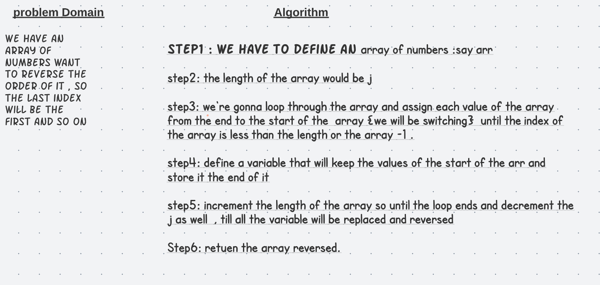
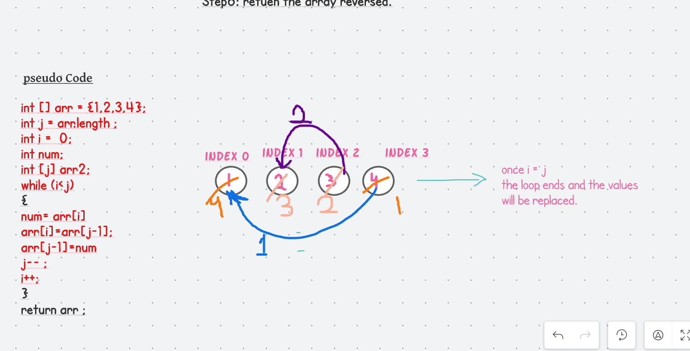
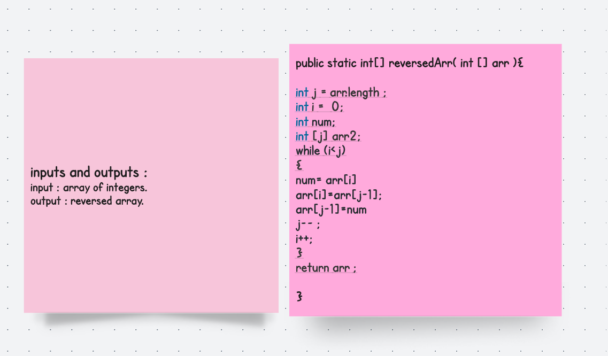

# Reverse an Array
<!-- Description of the challenge -->
we will be writing a code that will reverse the order of an array 

## Whiteboard Process
Problem Domain :
Write a function called reverseArray which takes an array as an argument. Without utilizing any of the built-in methods available to your language, return a new array with elements from input array in reversed order.

# Code 

## Approach & Efficiency
<!-- What approach did you take? Discuss Why. What is the Big O space/time for this approach? -->

step1 : we have to define an array of numbers :say arr  

step2: the length of the array would be j 

step3: we're gonna loop through the array and assign each value of the array  from the end to the start of the  array {we will be switching}  until the index of the array is less than the length or the array -1 .

step4: define a variable that will keep the values of the start of the arr and store it the end of it 

step5: increment the length of the array so until the loop ends and decrement the j as well  , till all the variable will be replaced and reversed 

Step6: retuen the array reversed.   