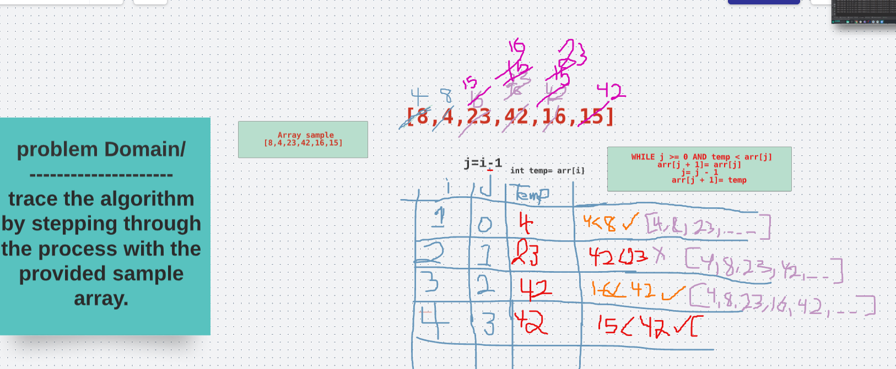

# Challenge 
Review the pseudocode below, then trace the algorithm by stepping through the process with the provided sample array. Document your explanation by creating a blog article that shows the step-by-step output after each iteration through some sort of visual.

Once you are done with your article, code a working, tested implementation of Insertion Sort based on the pseudocode provided.

You may review an example document HERE

Pseudocode
  InsertionSort(int[] arr)

    FOR i = 1 to arr.length

      int j <-- i - 1
      int temp <-- arr[i]

      WHILE j >= 0 AND temp < arr[j]
        arr[j + 1] <-- arr[j]
        j <-- j - 1

      arr[j + 1] <-- temp
Sample Arrays
In your blog article, visually show the output of processing this input array:

[8,4,23,42,16,15]

# Solution 
## Visual 

## Code 
public class SortInsertion {

   public  String insert(int arr[]){
       

//    int arr[] = {8,4,23,42,16,15};

    for (int i=0 ; i< arr.length ; i++){

      int j= i-1;
      int temp = arr[i];
      while (j>=0 && arr[j]< temp) {
        arr[j+1]= arr[j];
        j=j-1;

      }
      arr[j+1]=temp ;
    }
    return Arrays.toString(arr);
  }
}

## Test 

class inser{

  @Test
  void insertTest(){

    SortInsertion insertion = new SortInsertion();
    int arr[] = {8,4,23,42,16,15};
   String res = insertion.insert(arr);
    assertEquals("[42, 23, 16, 15, 8, 4]",res);
  }
}

## Big(O)
Efficency
Time: O(n^2)
The basic operation of this algorithm is comparison. This will happen n * (n-1) number of times…concluding the algorithm to be n squared.
Space: O(1)
No additional space is being created. This array is being sorted in place…keeping the space at constant O(1).