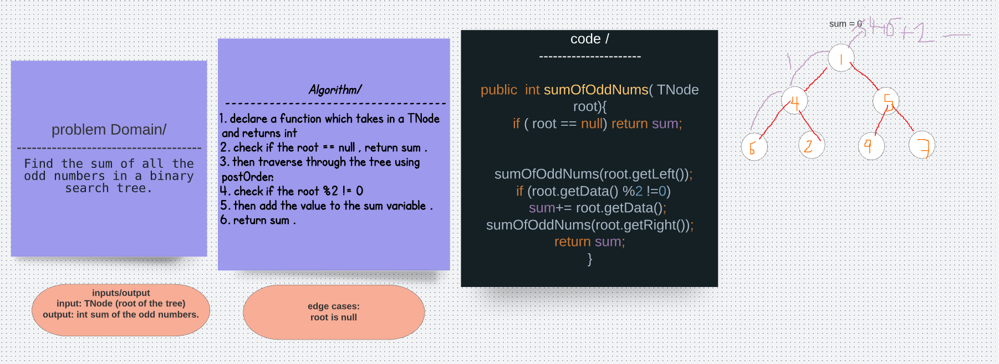

# Challenge 
Find the sum of all the odd numbers in a binary search tree. 
Any of the traversals (depth or breadth) will work for this.

# Solution 

# Big (O)
O(n) for time 
O(1) for space 

# Tests 
@Test
  void oddSumTest(){
      
    BinaryTree tree = new BinaryTree();
    TNode node = new TNode(1);
    node.setRight(new TNode(4));
    node.setLeft(new TNode(9));
    node.getLeft().setRight(new TNode(11));
    node.getLeft().setLeft(new TNode(14));
    node.getRight().setRight(new TNode(1));
    node.getRight().setLeft(new TNode(50));

    assertEquals(22, tree.sumOfOddNums(node));
  }