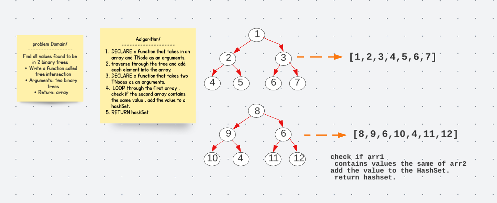

# Tree Intersection 

## Challenge 
Find all values found to be in 2 binary trees

Write a function called tree intersection
Arguments: two binary trees
Return: array.

 ## Solution 

 ## Code 

  public  static HashSet treeIntersection(TNode root1 , TNode root2 ){

    ArrayList<Object> arr1 = new ArrayList<>();
    arr1= treeIntersectionHelper(arr1,root1);

    ArrayList<Object> arr2 = new ArrayList<>();
    arr2= treeIntersectionHelper(arr2,root2);
    HashSet hashSet= new HashSet();
    for (Object value : arr1){
      if (arr2.contains(value))
        hashSet.add(value);

    }
    return hashSet;
  }

  private static ArrayList<
  Object> treeIntersectionHelper(ArrayList<
  Object> arr1, TNode node) {

    if (node==null ) return arr1;
    arr1.add(node.getData());
    treeIntersectionHelper(arr1,node.getLeft());
    treeIntersectionHelper(arr1,node.getRight());
    return arr1;
  }

## API 
` private static ArrayList< Object> treeIntersectionHelper(ArrayList< Object> arr1, TNode node)`

## Approach & Efficiency Big(O)
My approach was to use a HashSet as the returning value after a depth first search on both Binary Trees. The time complexity is O(n + h). 

 ## Egde cases 
 * two epmty trees
 * one empty tree
 * no intersection.

 
 ## Tests
 class TreeIntersection{

  TNode binaryTreeNode;
  BinaryTree binaryTree;
    TNode binaryTreeNode2;
    BinaryTree binaryTree2;
  @BeforeEach
  void createTree(){

    binaryTreeNode = new TNode(1);
    binaryTree = new BinaryTree(binaryTreeNode);

    binaryTreeNode.setLeft(new TNode(2));
    binaryTreeNode.setRight(new TNode(3));
    binaryTree.getRoot().getLeft().setLeft(new TNode(4));
    binaryTree.getRoot().getLeft().setRight(new TNode(5));
    binaryTree.getRoot().getRight().setLeft(new TNode(6));
    binaryTree.getRoot().getRight().setRight(new TNode(7));

    // second tree
    binaryTreeNode2 = new TNode(8);
    binaryTree2 = new BinaryTree(binaryTreeNode2);

    binaryTreeNode2.setLeft(new TNode(9));
    binaryTreeNode2.setRight(new TNode(6));
    binaryTree2.getRoot().getLeft().setLeft(new TNode(10));
    binaryTree2.getRoot().getLeft().setRight(new TNode(4));
    binaryTree2.getRoot().getRight().setLeft(new TNode(11));
    binaryTree2.getRoot().getRight().setRight(new TNode(12));

  }

  @Test
  void TreeIntersectionTest(){

  String expected= HashTable.treeIntersection(binaryTreeNode,binaryTreeNode2).toString();
  assertEquals("[4, 6]",expected);

  }
  @Test
    void testEmptyTree(){

    TNode binaryTreeNode3= new TNode();
    BinaryTree binaryTree4 =new BinaryTree();
    String exp=HashTable.treeIntersection(binaryTreeNode3,binaryTreeNode2).toString();
      assertEquals("[]" ,exp);
  }

}